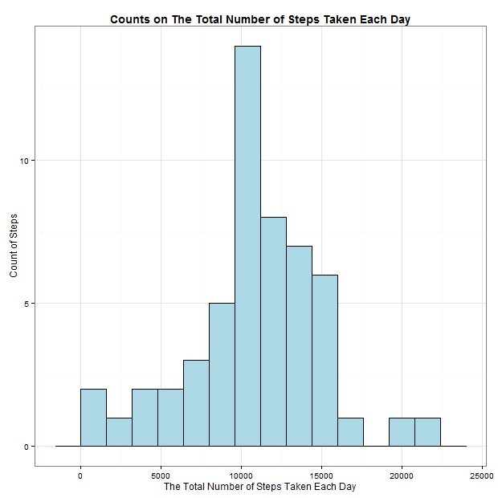

## **Reproducible Research**
 **Hsin Yu Cheng**    
 **June 14, 2015**    
 
 > Peer Assessment 1.    
 > Dataset : https://d396qusza40orc.cloudfront.net/repdata%2Fdata%2Factivity.zip        


## Download dataset from Internet
```{r}
setInternet2(TRUE)
temp <- tempfile()
download.file("https://d396qusza40orc.cloudfront.net/repdata%2Fdata%2Factivity.zip",temp)
data <- read.csv(unz(temp, "activity.csv"))
unlink(temp)
```


## Load Packages
```{r,eval=FALSE}
library(ggplot2)
library(scales)
library(dplyr)
library(tidyr)
```


```{r,include=FALSE}
library(ggplot2)
library(scales)
library(dplyr)
library(tidyr)
```


## Loading and preprocessing the data
```{r}

NewDate <- data %>% 
  mutate(steps = as.integer(steps),
         interval = as.character(interval),
         Date = as.Date(date, format("%Y-%m-%d")),
         Month = substring(Date,6,7),
         Day = substring(Date,9,10))
```

### **Question 1**:What is mean total number of steps taken per day?    
 > Ignore the missing values in the dataset.    
 > 1.Calculate the total number of steps taken per day.    
 > 2.Make a histogram of the total number of steps taken each day.    
 
```{r}
step <- NewDate %>%
  filter(!is.na(steps)) %>%
  group_by(Date) %>%
  summarise(Sum_steps = sum(steps))

step

ggplot(step, aes(x = Sum_steps)) + 
  geom_histogram(fill = "lightblue", binwidth = 1600, color = "black") +
  theme_bw() +
  ylab("Count of Steps") + 
  xlab("The Total Number of Steps Taken Each Day") +
  ggtitle("Counts on The Total Number of Steps Taken Each Day") + 
  theme(plot.title = element_text(lineheight=.8, face="bold", size = 14))
  
```
    

 > 3.Calculate and report the mean and median of the total number of steps taken per day.

```{r}

step %>% 
  summarise(mean = mean(Sum_steps),
            median = median(Sum_steps))

```
 * The **mean** of the total number of steps taken per day is 10766.19.    
 * The **median** of the total number of steps taken per day is 10765.    


***    
***    

### **Question 2**:What is the average daily activity pattern?    

 > 1.Make a time series plot (i.e. type = "l") of the 5-minute interval (x-axis) and the average number of steps taken, averaged across all days (y-axis)     
```{r}
intervals <- NewDate %>%
  filter(!is.na(steps)) %>%
  group_by(interval) %>%
  summarise(Mean_steps = mean(steps)) %>%
  mutate(interval = as.integer(interval))


ggplot(intervals, aes(x = interval , y = Mean_steps)) + 
  geom_line() +
  theme_bw() +
  ylab("The Average Number of Steps Taken") + 
  xlab("the 5-minute Interval") +
  ggtitle("The Average Number of Steps Taken on the 5-minute Interval") + 
  theme(plot.title = element_text(lineheight=.8, face="bold", size = 14))


```
     


 > 2.Which 5-minute interval, on average across all the days in the dataset, contains the maximum number of steps?    
```{r}
intervals %>% mutate(rank = min_rank(desc(Mean_steps))) %>% filter(rank == 1)
```
 * **The interval 835** contains the maximum number of steps at 206.1698.    

***    
***    

### **Question 3** : Imputing missing values.    

 > 1.Calculate and report the total number of missing values in the dataset.       
```{r}
Missing <- NewDate %>%
  filter(is.na(steps)) %>%
  summarise(Missing_Value = length(steps))
Missing
```
 * The total number of missing values are **2304**.    
 
     
 > 2.Devise a strategy for filling in all of the missing values in the dataset.         
 > 3.Create a new dataset that is equal to the original dataset but with the missing data filled in.         
 >    
 > **Strategy** :     
 > Use the mean of total number steps corresponding to the 5 interval for filling in all of the missing values.        
```{r}
only_Missing_Value <- NewDate %>% filter(is.na(steps))

for (i in 1:nrow(only_Missing_Value)) {
  only_Missing_Value$steps[i] <- intervals[which(only_Missing_Value$interval[i] == intervals$interval), ]$Mean_steps
    }

All_data <- rbind(only_Missing_Value, NewDate %>% filter(!is.na(steps)))

sum(is.na(All_data))

```
        
 - In the new dataset, the number of missing values are 0.    


 > 4.Make a histogram of the total number of steps taken each day and Calculate and report the mean and median total number of steps taken per day.            
```{r}

No_NA <- All_data %>%
  group_by(Date) %>%
  summarise(Sum_steps = sum(steps))


ggplot(No_NA, aes(x = Sum_steps)) + 
  geom_histogram(fill = "lightblue", binwidth = 1600, color = "black") +
  theme_bw() +
  ylab("Count of Steps") + 
  xlab("The Total Number of Steps Taken Each Day") +
  ggtitle("Counts on The Total Number of Steps Taken Each Day") + 
  theme(plot.title = element_text(lineheight=.8, face="bold", size = 14))

  
```

```{r}
No_NA %>% 
  summarise(mean = mean(Sum_steps),
            median = median(Sum_steps))
```
 **Impact :**    
 - The **mean** of the total number of steps taken per day is **10766.19**, which is **same** to that from the first part of the assignment.        
 - The **median** of the total number of steps taken per day is **10766.19**, which is **different** to that from the first part of the assignment at **10765**. 
 
     
 
***    
***    

## **Question 4**:Are there differences in activity patterns between weekdays and weekends?

 > 1.Create a new factor variable in the dataset with two levels - "weekday" and "weekend" indicating whether a given date is a weekday or weekend day.    

```{r}
All_data$weekday <- as.POSIXlt(as.Date(All_data$Date))$wday 

All_data <- All_data %>%
  mutate(Week = ifelse(weekday == 0 | weekday == 6, "weekend", "weekday"))

table(All_data$Week)

```

 > 2.Make a panel plot containing a time series plot (i.e. type = "l") of the 5-minute interval (x-axis) and the average number of steps taken, averaged across all weekday days or weekend days (y-axis).     
```{r}

Q4 <- All_data %>%
  group_by(Week, interval) %>%
  summarise(mean_steps = mean(steps)) %>%
  mutate(interval = as.integer(interval))


ggplot(Q4, aes(x = interval , y = mean_steps)) + 
  geom_line(color = "orange") +
  facet_wrap(~Week, nrow=2, ncol=1) +
  theme_bw() +
  ylab("The Average Number of Steps Taken") + 
  xlab("the 5-minute Interval") +
  ggtitle("The Average Number of Steps Taken on the 5-minute Interval") + 
  theme(plot.title = element_text(lineheight=.8, face="bold", size = 14))

```

    

***    
***    


